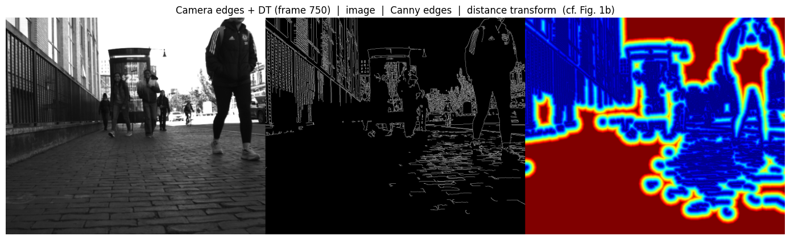
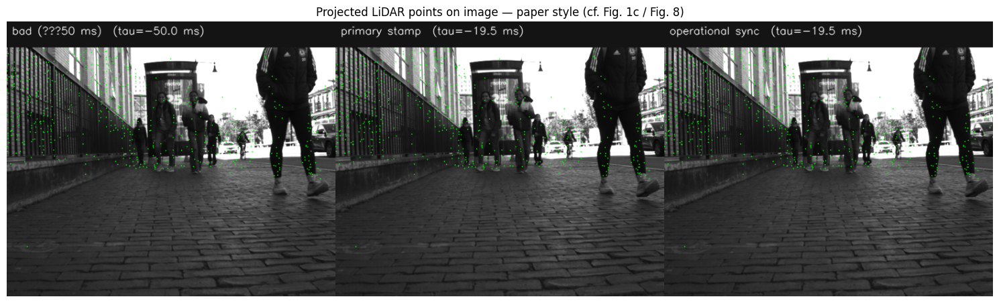
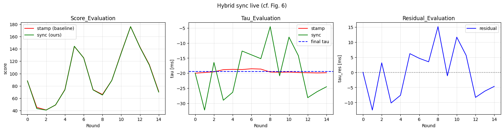

# Camera–LiDAR Hybrid Temporal Sync

Stamp-primary temporal sync with paper-closer residual path (Wang et al. [arXiv:2207.10454](papers/2207.10454.pdf)), plus upgrades that avoid the paper’s soft-sync / free-search failure modes.

## Model

| Layer | Role |
|-------|------|
| `tau_stamp` | **Primary sync** — median nearest camera−LiDAR stamp |
| `tau_res` | Edge residual in ±50 ms around stamps (EMA), optional IMU warp + dynamic filter |
| `tau_sync` | **Operational** — \(t_C \approx t_L + \tau_{sync}\) |
| `tau_unconst` | **Diagnostic only** — unconstrained score peak / alias flag |
| `T_CL` | Stiff prior + optional slow refine (±2°, ±5 cm) |

## Results

Measured on `huntington.mcap` (750 LiDAR scans, 1500 camera frames, 15,000 IMU samples, 15 sliding windows of 50 scans each):

| Approach | Result | Why it fails / works |
|---|---|---|
| Unconstrained edge-score search (naive Canny-DT optimum, ±500 ms) | **Not stable**: 130 ms with initial extrinsics, −70 ms after a ±2°/±5 cm extrinsic refine — a >150 ms swing from a small, physically-plausible extrinsics nudge | Repetitive scene structure (building facades, fences, cobblestones) makes the score landscape aliased: many candidate offsets score nearly as well, so the global optimum tracks whichever alias the current extrinsics happen to favor, not the true sensor timing offset |
| Raw timestamp difference only (`tau_stamp`) | **-19.49 ms**, stable to within ~1.5 ms across all 15 independent windows, computed as the median gap over all 748 camera–LiDAR pairs | Physically grounded (driver/OS capture timestamps) and immune to extrinsics or scene content — but can't detect a small, real, *systematic* driver-latency bias since a consistent bias looks identical to a correct measurement in the gap statistics |
| **This pipeline (stamp-primary + bounded residual)** | **tau_sync = -19.49 ms**, `tau_res` clipped to ±50 ms and EMA-smoothed, per-window alignment score consistent (40–176 range) across all windows | Anchors on the stable timestamp estimate, then lets the edge score correct only a small, plausible latency bias — the residual band is deliberately too narrow to reach the ~70–130 ms alias basin, so the operational answer can't be hijacked by scene-driven aliasing |

**Net effect vs. a naive edge-only or message-filter-style sync:** the operational offset stays put (`tau_sync = -19.49 ms`) regardless of which extrinsics or scan window feeds it, while a pure score-search answer moves by >150 ms under the same conditions — and `alias_suspect`/health-check logic makes that instability visible instead of silently trusting whichever local optimum the grid search happened to land on.

On the spatial side, the KD-tree adjacent-frame dynamic filter + 3-frame IMU-based densification triples usable LiDAR edge density per scan without a segmentation-network dependency, and without folding moving objects into the fused cloud.

## Example outputs

Notebook figures below follow the visual conventions of Wang et al. (arXiv:2207.10454) — grayscale image / Canny edges / distance transform triptychs, and uniform-green LiDAR points projected onto the raw image, rather than a distance-colored heatmap.

**Camera edges + distance transform** (§4 — `image | Canny edges | distance transform`, cf. Fig. 1b):



**Projected LiDAR points across candidate offsets** (§8 — bad / stamp-primary / operational-sync comparison, cf. Fig. 1c / Fig. 8):



**Per-window score / tau / residual convergence** (§6 — 15 sliding windows over 750 LiDAR scans, cf. Fig. 6):



## Layout

```
Calibration/
├── assets/                # README figures (edge/DT triptych, projection comparison, score/tau plots)
├── calib/
│   ├── extract.py, imu.py, lidar.py, camera.py
│   ├── geometry.py, scoring.py
│   ├── pose_warp.py, lines.py, dynamic_filter.py, extrinsic_refine.py
│   ├── hybrid_sync.py, viz.py
├── papers/2207.10454.pdf, REFERENCES.md
├── Camera_Lidar_Hybrid_Sync.ipynb
├── huntington.mcap
└── requirements.txt
```

## Setup

```bash
cd ~/Desktop/AFR/Calibration
pip install -r requirements.txt
jupyter notebook Camera_Lidar_Hybrid_Sync.ipynb
```

## Notebook flags

- `USE_POSE_WARP` — IMU \(T_v\) warp (paper-style)
- `USE_DYNAMIC_FILTER` — adjacent-frame NN dynamic removal
- `USE_LSD` — LSD lines (else Canny DT)
- `REFINE_EXTRINSICS` — slow stiff \(T_e\) refine
- `RESIDUAL_BAND` — default ±0.05 s around stamps
